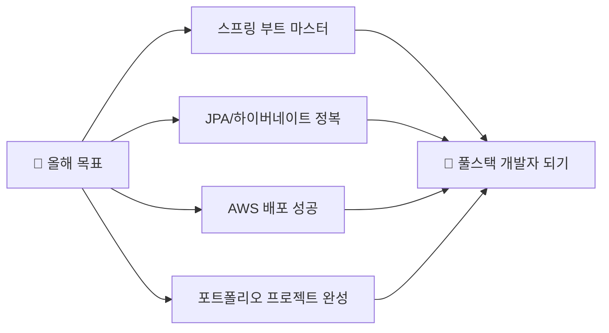

# 🚀 안녕하세요! 자바 개발자 지망생입니다

<div align="center">
  
  
  
  
  
</div>

---

## 👨‍💻 나는 누구인가?

```javascript
const 개발자 = {
    이름: "체험중인 개발자",
    위치: "대한민국 🇰🇷",
    전공분야: "백엔드 개발",
    현재공부중: ["스프링 부트", "JPA", "AWS"],
    관심분야: ["클린 코드", "시스템 설계", "문제 해결"],
    특징: "커피 없으면 코딩 못하는 사람 ☕️"
};
```

## 🛠️ 내가 다루는 기술들

<div align="center">

### 🔥 주력 기술


### 🗄️ 데이터베이스 & 도구들


### 📚 현재 공부 중인 것들


</div>

---

## 📊 깃허브 통계

<div align="center">
  
  
  
  
</div>

<div align="center">
  
  
  
</div>

---

## 🎯 2025년 목표

<div align="center">



</div>

---

## 🏆 깃허브 트로피

<div align="center">
  
  
  
</div>

---

## 📈 활동 그래프

<div align="center">
  
  
  
</div>

---

## 🌐 연락하기

<div align="center">
  
  [](mailto:elpin0428@naver.com)
  [](https://che01.tistory.com/)
  
</div>

---

<div align="center">
  
  ### 💭 오늘의 개발 명언
  
  
  ### 🐾 내 깃허브 펫들
  <a href="https://github.com/devxb/gitanimals">
    
  </a>

---

<div align="center">
  
  
  
  **방문해주셔서 감사합니다! 🚀 함께 멋진 프로젝트를 만들어봐요!**
  
</div>
