# 🚀 Welcome to my GitHub Universe!

<div align="center">
  
  
  
  
  
</div>

---

## 👨‍💻 About Me

```javascript
const developer = {
    name: "자바 개발자 지망생",
    location: "South Korea 🇰🇷",
    focus: "Backend Development",
    currentlyLearning: ["Spring Boot", "JPA", "AWS"],
    interests: ["Clean Code", "System Design", "Problem Solving"],
    funFact: "Coffee driven programmer ☕️"
};
```

## 🛠️ Tech Arsenal

<div align="center">

### 🔥 Main Stack


### 🗄️ Database & Tools


### 📚 Currently Learning


</div>

---

## 📊 GitHub Analytics

<div align="center">
  
  
  
  
</div>

<div align="center">
  
  
  
</div>

---

## 🎯 Current Goals

```mermaid
graph LR
    A[🎯 Goals 2025] --> B[Master Spring Boot]
    A --> C[Learn JPA/Hibernate]
    A --> D[Deploy on AWS]
    A --> E[Build Portfolio Projects]
    B --> F[🚀 Full-Stack Developer]
    C --> F
    D --> F
    E --> F
```

<div align="center">



</div>

---

## 🏆 GitHub Trophies

<div align="center">
  
  
  
</div>

---

## 📈 Contribution Graph

<div align="center">
  
  
  
</div>

---

## 🌐 Connect With Me

<div align="center">
  
  [](mailto:elpin0428@naver.com)
  [](https://che01.tistory.com/)
  
</div>

---

<div align="center">
  
  ### 💭 Random Dev Quote
  
  
  ### 🐍 Contribution Snake
  
  
</div>

---

<div align="center">
  
  
  
  **Thanks for visiting! 🚀 Let's build something amazing together!**
  
</div>
